# 목차

1. [**서비스 소개**](#1)
2. [**기획 배경**](#2)
3. [**개발 멤버**](#3)
4. [**기능 소개**](#4)
5. [**시연 영상**](#5)
6. [**기술 스택**](#6)
7. [**프로젝트 일정 및 산출물**](#7)
8. [**회고**](#8)

 

---

 

# 🛫서비스 소개

## 서비스 설명

### 개요

- 한줄 소개 : **`사용자 맞춤형`** 여행 **`동행 모집`** 플랫폼
- 서비스 명 : **`나랑`**

### 타겟 🎯

- 시간과 돈은 준비되어 있는데 지인과 시간 맞추기 힘든 사람들
- 자신이 부족한 역할을 채워 완성도 있는 여행을 가고싶은 사람들
- 재미있고 새로운 여행을 가고싶은 사람들

  > 👉 \*\* **여행을 가고 싶은 모든 사람들!** \*\*

# 🛫기획 배경

## 배경

여행을 가는 건 좋은건데 시간이 맞는 지인이 없거나, 홀로 계획 세우고 오히려 일처럼 느껴질 때가 있습니다. **`나랑`**은 이러한 불편함에 편리함을 제공하고 언제든지 떠날 준비가 되어있는 사람들과 함께 여행을 갈 수 있도록 하고자 하였습니다.
 
 
우리의 여행 동행 모집 서비스 장점은 다음과 같습니다. 먼저, 필요한 역할을 구하고 자신있는 역할을 지원하기 때문에 서로의 장단점을 채워주는 동행을 구해 여행을 떠날 수 있습니다. 또한 실시간 채팅을 통해 소통하고, 서로 계획을 함께 작성 및 수정하며 서로 여행에서 추구하는 점을 맞춰나가 성공적인 여행을 떠날 수 있습니다.

## 목적 ☁

**여행을 떠나고 싶을 때, 언제든 나에게 필요한 동행을 구해서 떠나자!**

## 의의

- 찬구. 가족 이외의 새로운 사람들과 함께하는 여행에 대한 설렘 호기심 기대감
- 자신있는 역할을 지원하고, 부족한 역할을 채워 여행의 완성도 상승
- 함께 가는 사람들끼리 여행 일정을 공유해서 수정 및 계획 가능

# 🛫개발 멤버 및 일정 소개

## 📆 프로젝트 기간

### 24.01.08 ~ 24.02.16

- 기획 및 설계 : 24.01.08 ~ 24.01.17
- 프로젝트 구현 : 24.01.18 ~ 24.02.15
- 버그 수정 및 산출물 정리 : 24.02.14 ~ 24.02.16

 

<table>
    <tr>
        <td height="140px" align="center"> <a href="https://github.com/yhc-key">
                👑 조용환  (Front-End) </a>  </td>
        <td height="140px" align="center"> <a href="https://github.com/kbs3103">
                ⛑ 구본승  (Front-End) </a>  </td>
        <td height="140px" align="center"> <a href="https://github.com/se2develop">
                ⛑ 노세희  (Front-End) </a>  </td>
        <td height="140px" align="center"> <a href="https://github.com/youngkimi">
                ⛑ 김영섭  (Back-End) </a>  </td>
        <td height="140px" align="center"> <a href="https://github.com/Song-YoonJae">
                ⛑ 송윤재  (Back-End) </a>  </td>
        <td height="140px" align="center"> <a href="https://github.com/">
                ⛑ 조예진  (Back-End) </a>  </td>
    </tr>
    <tr>
        <td align="center">UI/UX React WebSocket</td>
        <td align="center">UI/UX React</td>
        <td align="center">UI/UX React</td>
        <td align="center">REST API CI/CD Infra </td>
        <td align="center">REST API Database</td>
        <td align="center">REST API Database</td>
    </tr>
</table>

# 🛫기능 소개

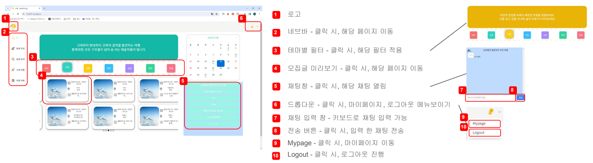
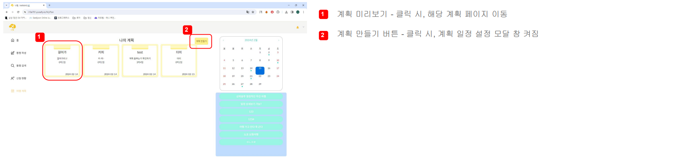
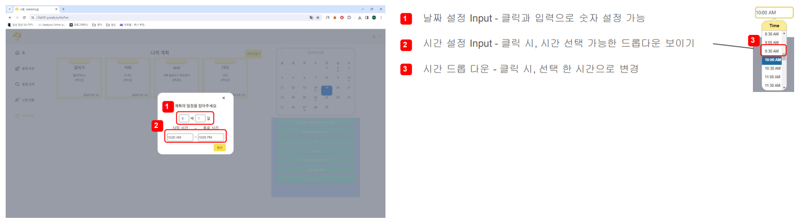
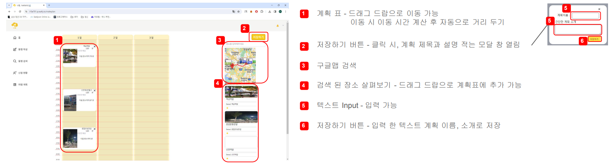
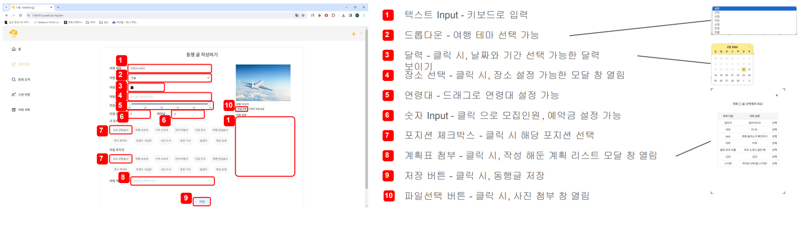
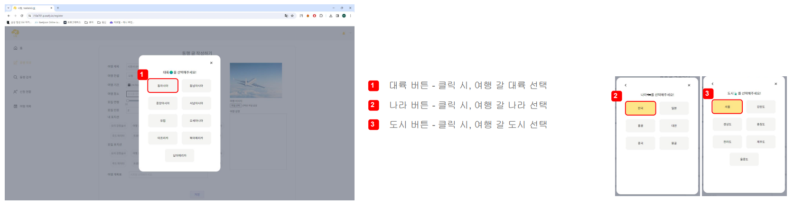
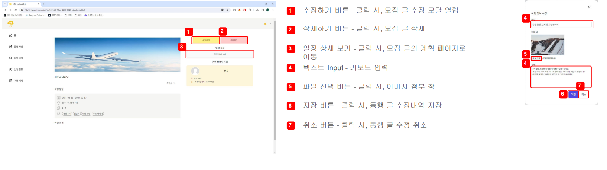
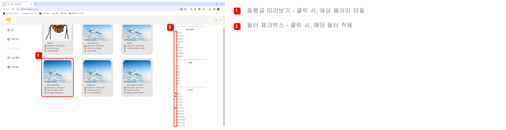
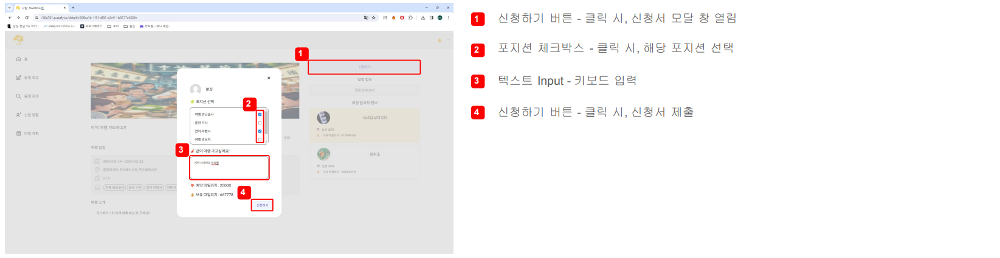

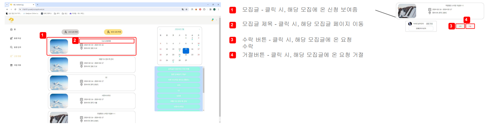

# 🛫시연 영상

## 회원가입 및 로그인

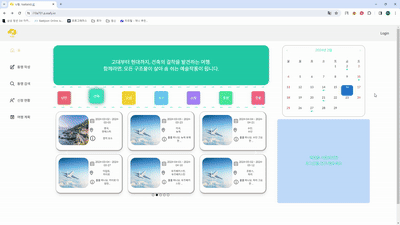

## 메인화면

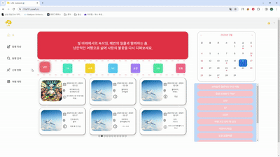

## 마이페이지

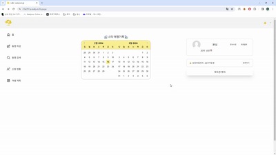

## 동행글 작성

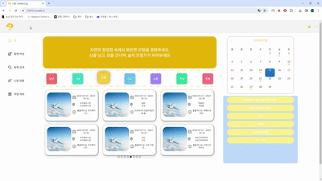

## 동행글 필터링

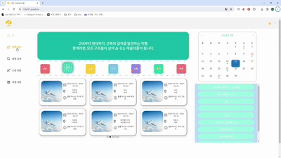

## 동행 신청하기

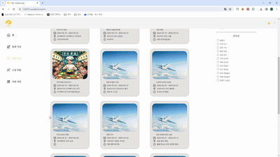

## 신청 현황 보기

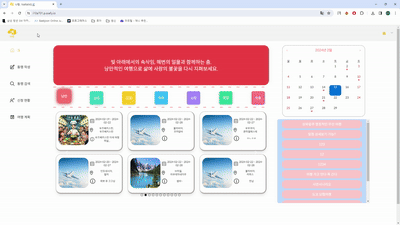

## 알림 후 신청 수락

## 계획표 만들기

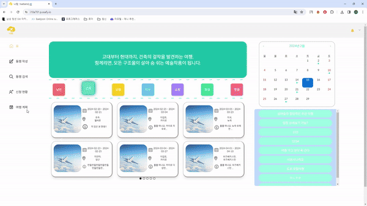

## 실시간 채팅 기능

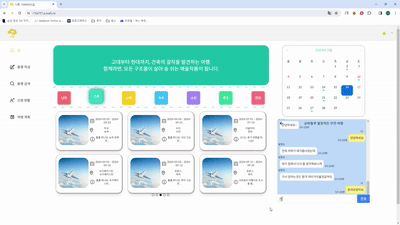

## 인피니티 스크롤 & 역 인피니티 스크롤

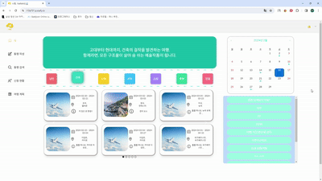

## 마일리지 충전

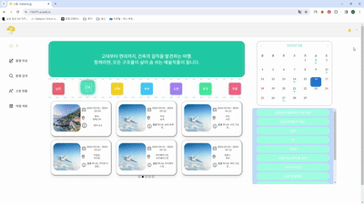

# 🛫기술 스택

## 1. Web Socket

### Web Socket이란?

<aside>

> 웹 소켓은 사용자의 브라우저와 서버 사이의 메세지를 교환하기 위한 통신 기술입니다.

Socket Connection을 유지한 채, 실시간으로 양방향 통신 혹은 데이터 전송이 가능하고, 상태 프로토콜, 클라이언트와 서버가 한 번 연결되면 같은 연결을 이용해 통신하기 대문에 TCP 커넥션 비용을 아낄 수 있습니다.

### 적용

`나랑` 에서는 실시간 상태 공유를 위해 모집글 별 채팅방 기능에 webSocket을 사용합니다.

## 2. SSE(Server-Sent Event)

> SSE는 웹 애플리케이션, 서버에서 클라이언트로 단뱡향으로 실시간 이벤트를 전송하는 웹 기술입니다.

서버에서 발생하는 업데이트나 알림 등을 실시간으로 클라이언트에게 전달할 수 있습니다. 재연결 기능을 제공하기 때문에 연결이 끊어졌을 때 자동으로 연결하고, 기존의 폴링 방식과 비교했을 때 효율적이며, 서버와 클라이언트 간의 불필요한 통신을 최소화합니다.

### 적용

`나랑` 에서는 실시간 상태 공유를 위해 신청 요청, 수락, 거절 알림 기능에 SSE를 사용합니다.

## 3. gRPC

<aside>

> gRPC는 Google에서 개발한 오픈 소스 원격 프로시저 호출(RPC) 시스템입니다

각 Service는 자신의 데이터를 독점적으로 관리하고, 다른 Service는 해당 서비스에 요청합니다.

gRPC는 Google에서 개발한 프로토콜 버퍼를 사용하여 통신 프로토콜을 정의합니다.
프로토콜 버퍼는 효율적인 이진 직렬화 포맷으로 데이터의 효율적 전송과 저장을 도와줍니다.
또한 프로토콜 버퍼를 통해 Server의 자원을 Client(Stub)가 사용할 수 있습니다.

gRPC는 여러 가지 언어를 지원하며, 이를 통해 서로 다른 언어로 작성된 서비스 간에도 통신이 가능합니다.
gRPC는 양방향 스트리밍을 지원하여 요청 없이도 데이터 전달이 가능하고, 클라이언트와 서버 간에 스트림을 열어 다중 Stub 스트리밍이 가능합니다.

### 적용

`나랑` 에서는 각 서비스 간 데이터 격리가 이루어져 있습니다. 네트워크 자원의 효율적 사용을 위해서 Micro Service 사이 통신에 gRPC를 사용합니다.

## 3. 개발 환경

     
     
    
   

 <b> 상세 기술스택 및 버전</b> 

| 구분     | 기술스택        | 상세내용             | 버전    |
| -------- | --------------- | -------------------- | ------- |
| 공통     | 형상관리        | Gitlab               | \-      |
|          | 이슈관리        | Jira                 | \-      |
|          | 커뮤니케이션    | Mattermost, Notion   | \-      |
| BackEnd  | DB              | MySQL                |         |
|          | DB              | MongoDB              |         |
|          |                 | JPA                  | \-      |
|          | Java            | OpenJDK              | 17.0.9  |
|          | Spring          | Spring               | 5.3.6   |
|          |                 | Spring Boot          | 3.2.1   |
|          | IDE             | IntelliJ             | 23.3.2  |
|          | Cloud Storage   | AWS S3               | \-      |
|          | Build           | Gradle               | 7.3.2   |
|          | WebRTC          | Kurento Media Server | 6.16    |
|          | WebRTC          | Kurento              | \-      |
|          | gRPC            | gRPC                 | 1.35.0  |
|          |                 | protobuf             | 3.14.0  |
|          |                 | protobufPlugin       | 0.8.14  |
|          | API Docs        | Swagger2             | 3.0.0   |
| FrontEnd | HTML5           |                      | \-      |
|          | CSS3            |                      | \-      |
|          | JavaScript(ES6) |                      | \-      |
|          | React           | React                | 18.2.0  |
|          | React           | react-router-dom     | 6.21.2  |
|          |                 | @reduxjs/toolkit     | 2.0.1   |
|          |                 | react-beautiful-dnd  | 13.1.1  |
|          |                 | react-calendar       | 4.8.0   |
|          |                 | react-datepicker     | 5.0.0   |
|          |                 | tailwindCSS          | 3.4.1   |
|          | WebSocket       | @stomp/stompjs       | \-      |
|          | WebSocket       | stompjs              | \-      |
|          | WebSocket       | sockjs-client        | 1.6.1   |
|          | IDE             | Visual Studio Code   | 1.85.2  |
| Server   | 서버            | AWS EC2              | \-      |
|          | 배포            | Docker               | 25.10.1 |
|          | 배포            | Jenkins              | 2.444   |

## 4. CI/CD 배포 환경

# 🛫프로젝트 산출물

## 프로젝트 진행

### 1. Git flow

---

Git flow 사용을 위해 우아한 형제들의 [git flow](https://techblog.woowahan.com/2553/)을 참고했습니다. front 와 back 으로 나누어 `faature`의 하위 브랜치를 사용하였으며 `develop` 브랜치와 `develop_frontend` 브랜치로 merge 하여 사용했습니다. 
`commit message`는 `feat: 기능 구현 내용` 과 같이 통일하여 작성했습니다. 

### 2. Jira

---

매주 월요일 오전 금주의 진행 이슈를 백로그에 등록했습니다. 전주에 완료하지 못한 이슈나, 앞으로 진행할 이슈들을 추가하였습니다.

- 에픽은 개발, 미팅, 학습 등으로 구성했습니다.
- 스토리는 명확한 전달을 위하여 `API 명세서 작성`와 같이 작성했습니다.
- 작업현황을 지라에 반영함으로써 각 팀원이 어떤 작업을 하고있는지, 일정에 딜레이가 있는지 한 눈에 확인할 수 있었습니다. 
  

## 프로젝트 산출물

### 1. Figma

[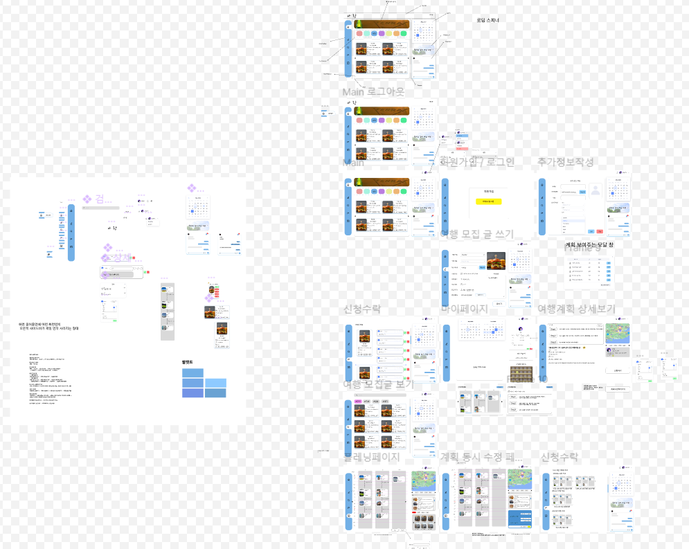](https://www.figma.com/file/Ig653eosD7BMcO7vaSbXcc/%EB%82%98%EB%9E%91?type=design&node-id=0%3A1&mode=design&t=xQdRy5vecULzInJH-1)
 

### 2. ERD / Architecture

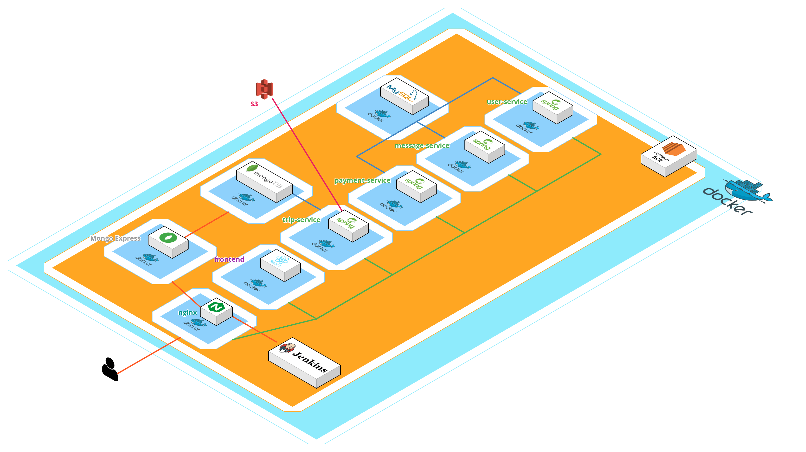

 

### 3. API 문서

[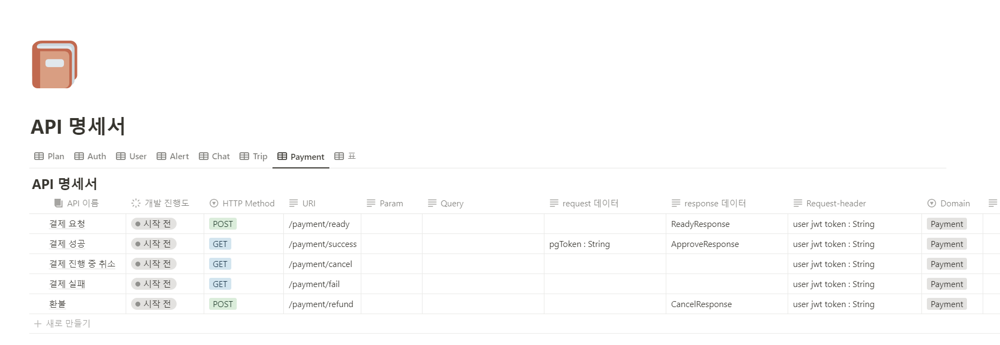](https://cheddar-cloudberry-278.notion.site/API-12102a6f33ee4c719a7052d4aee29b9c)

# 🛫회고

- [조용환](https://github.com/yhc-key) :
- [구본승](https://github.com/kbs3103) :
- [노세희](https://github.com/se2develop) :
- [김영섭](https://github.com/youngkimi) :
- [송윤재](https://github.com/Song-YoonJae) :
