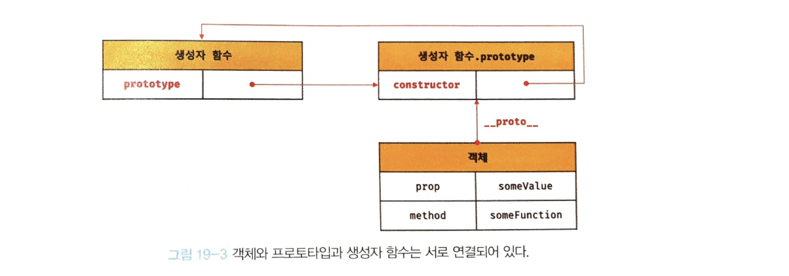
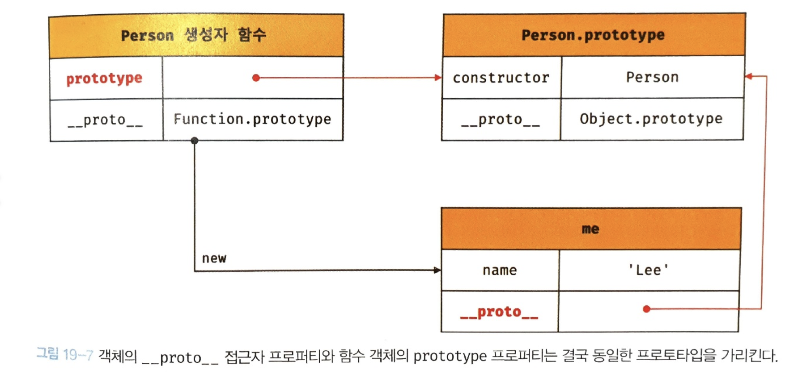
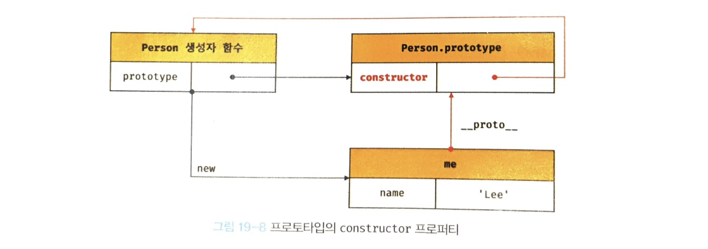
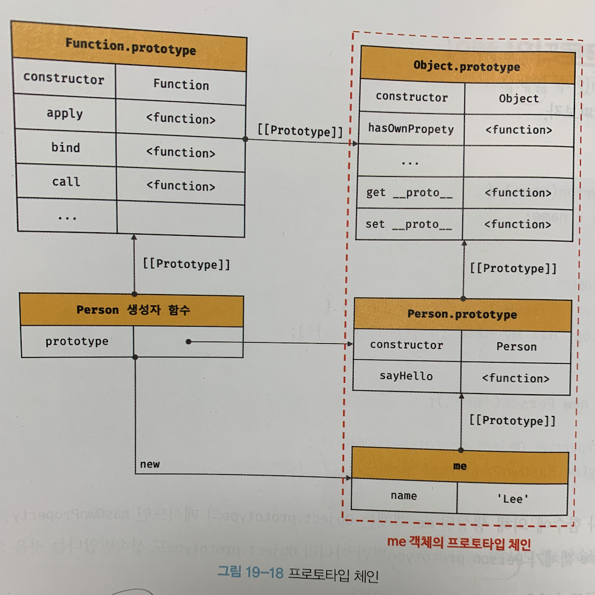
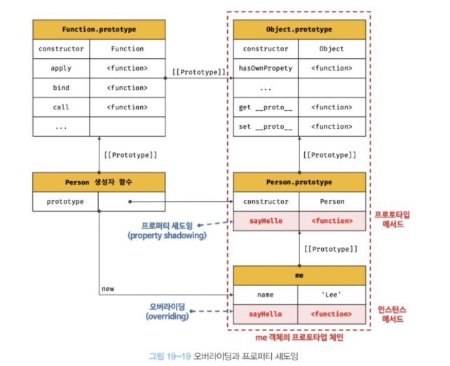
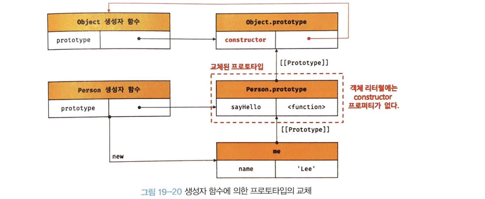
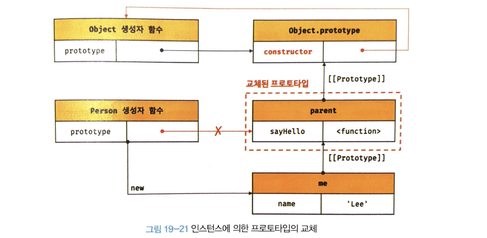
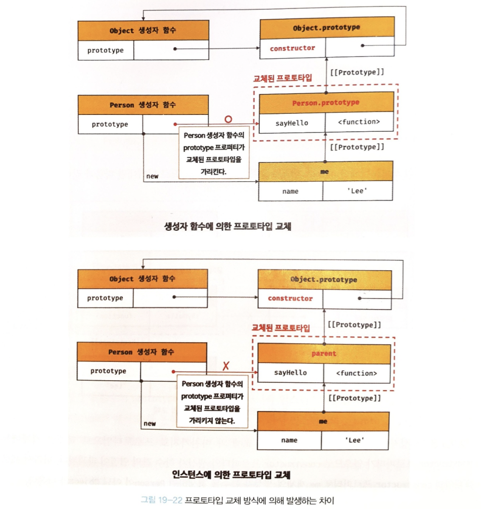

# chapter 19 : prototype
자바 스크립트는 객체 기반의 프로그래밍 언어이며 원시 타입의 값을 제외한 나머지 값들은 모두 객체이다.
## 객체지향 프로그래밍

객체 : 속성을 통해 여러 개의 값을 하나의 단위로 구성한 복합적인 자료구조  
객체지향 프로그래밍 : 전통적인 명령형 프로그래밍의 절차지향적 관점에서 벗어나 객체의 집합으로 프로그램을 표현하려는 프로그래밍 패러다임  
객체지향 프로그래밍은 객체의 상태(state)와 동작(behavior)을 하나의 논리적인 단위로 묶어 생각한다.  
즉 이러한 관점에서 객체는 **상태 데이터와 동작을 하나의 논리적인 단위로 묶은 복합적인 자료구조**라고 할 수 있다.  
이 때의 상태 데이터 = property, 동작 = method 이다.
## 상속과 프로토타입
상속 : 객체지향 프로그램의 핵심 개념, 어떤 객체의 프로퍼티 또는 메서드를 다른 객체가 상속받아 그대로 사용할 수 있는 것  
js는 프로토타입 기반 상속 구현.  
생성자로 인스턴스 만들 시 불필요한 메서드가 중복 생산될 수 있으나, 프로토타입으로 선언 시 중복을 제거할 수 있다.
## 프로토타입 객체
프로토타입 객체 : 객체 간 상속을 구현하기 위해 사용  
상위 객체는 공유 프로퍼티(메서드 포함)을 제공, 하위 프로퍼티는 자유롭게 사용 가능   
모든 객체는 [[Prototype]]이라는 내부 슬롯을 가지며, 프로토타입의 참조를 가진다. 이 값은 객체 생성 방식에 의해 결정된다.  
  
모든 객체는 하나의 프로토타입을 가지며, 모든 프로토타입은 생성자 함수와 연결되어 있다.  
생성자 함수는 자신의 prototype 로퍼티를 통해, 프로토타입은 자신의 constructor 프로퍼티를 통해 생성자 함수에 접근할 수 있다.
### ```__proto__``` 접근자 프로퍼티
[[Prototype]] 내부 슬롯에 간접적 접근을 ```__proto__```(접근자 프로퍼티, getter/setter)를 통해 함.  
Object.prototype의 프로퍼티로 모든 객체는 상속을 통해 ```__proto__```사용 가능  

#### ```__proto__```를 사용하는 이유
상호 참조에 의해 프로토타입 체인이 생성되는 것을 방지하기 위해.

#### ```__proto__``` 접근자 프로퍼티를 코드 내에서 직접 사용하는 것은 권장하지 않음.
```__proto__```는 ES6부터 브라우저 호환성을 고려하여 표준 채택  
모든 객체가 ```__proto__```를 사용할 수 있진 않기 때문에 사용 권장 X  
직접 상속을 통해 Object.prototype 상속받지 않는 객체 생성이 가능 함. 이 경우 ```__proto__``` 사용 불가.  
<br/>
프토토타입 참조 취득 시 Object.getPrototypeOf, 교체 시 Object.setPrototypeOf 메서드 사용 권장.  

### 함수 객체의 prototype 프로퍼티  
함수 객체만이 소유하는 prototype 프로퍼티는 생성자 함수가 생성할 인스턴스의 프로토타입을 가리킨다.    
non-constructor(화살표 함수 ES6 메서드 축약 표현 정의 메서드)는 prototype 프로퍼티 소유 x, 프로토타입도 생성 x.  
```__proto__```와 함수 객체만의 prototype은 결국 동일한 프로토타입을 가리킴. 하지만 사용하는 주체는 조금 다름.  
```__proto__``` => 모든 객체 : 객체가 자신의 프로토타입에 접근, 교체에 사용  
prototype => 생성자 함수 : 자신이 생성할 객체(인스턴스)의 프로토타입을 할당하기 위해 사용  
  
### 프로토타입의 constructor 프로퍼티와 생성자 함수
모든 프로토타입은 자신을 참조하고 잇는 생성자 함수를 가리키는 constructor 프로퍼티를 가짐.    

## 리터럴 표기법에 의해 생성된 객체의 생성자 함수와 프로토타입
Object 생성자 함수 호출과 객체 리터럴의 평가는 추상 연산 OrdinaryObejctCreate를 호출하여 빈 객체를 생성하는 점에서 동일하나 new.target의 확인이나 프로퍼티를 추가하는 처리 등 세부 내용은 다르다.  
함수 객체는 생성자 함수로 만들면 렉시컬 스코프 및 클로저를 만들지 않고, 선언문, 표현식의 경우에는 만든다.  

이렇듯 차이를 보이지만, 프로토타입과 생성자 함수는 단독으로 존재할 수 없고 언제나 쌍으로 존재한다.
큰 틀에서 보면 생성자 함수와 리터럴 표기법으로 생산한 객체를 생성한 생성자 함수로 생각해도 무리는 없다.  

## 프로토타입의 생성 시점
프로토타입은 생성자 함수가 생성되는 시점에 더불어 생성된다.
### 사용자 정의 생성자 함수와 프로토타입 생성 시점
- constructor는 함수 정의가 평가되어 함수 객체를 생성하는 시점에 프로토타입도 더불어 생성된다.   
- non-constructor는 프로토타입이 생성되지 않는다.  
- 함수 선언문은 런타임 이전에 js 엔진에 의해 먼저 실행되고, 이 때 생성된 프로토타입은 생성자 함수의 prototype 프로퍼티에 바인딩된다.  
- 생성된 프로토타입의 프로토타입은 언제나 Object.prototype
### 빌트인 생성자 함수와 프로토타입 생성 시점
- Object, String, Number, Function, Array, RegExp, Date, Promise 등과 같은 빌트인 생성자 함수도 일반 함수와 마찬가지로 빌트인 생성자 함수가 생성되는 시점에 프로토타입 생성  
- 모든 빌트인 생성자 함수는 전역 객체 생성 시점에 생성. (빌트인 생성자 함수의 prototype 프로퍼티에 바인딩)  
- 생성자 함수 또는 리터럴 표기법으로 객체 생성시 프로토타입은 생성된 객체의 [[Prototype]] 내부 슬롯에 할당된다.
### 객체 생성 방식과 프로토타입의 결정
객체 생성 방법
- 객체 리터럴
- Object 생성자 함수
- 생성자 함수
- Object.create 메서드
- 클래스(ES6)

조금씩 다르지만 추상 연산 OrdinaryObjectCreate에 의해 생성된다는 공통점을 가짐.
### 생성 방식별 프로토타입들
객체 리터럴, Object 함수 -> Object.prototype -> 객체 리터럴 내부에 프로퍼티 추가와 빈 객체 이후 프로퍼티 추가 차이  

생성자 함수 -> 생성자 함수의 prototype 프로퍼티에 바인딩되어 있는 객체

## 프로토타입 체인
- 부모를 찾아올라가는 것처럼 프로토타입도 거슬러 올라가 해당 과정에 있는 모든 프로퍼티, 메서드를 사용할 수 있음  
- 프로토타입의 프로토타입은 언제나 Object.prototype  
-     
- Object.prototype까지 올라가서도 검색 불가시 undefined를 반환한다.
- 상속과 프로퍼티 검색을 위한 메커니즘
- 스코프 체인은 식별자 검색을 위한 메커니즘

## 오버라이딩과 프로퍼티 섀도잉
```js
const Person = (function() {
    //생성자 함수
    function Person(name) {
        this.name = name;
    }

    // 프로토타입 메서드
    Person.prototype.sayHello = function () {
        console.log(`Hi! My name is ${this.name}`);
    };
    
    //생성자 함수 반환
    return Person;
}());

const me = new Person('Lee');

//인스턴스 메서드
me.sayHello = function() {
    console.log(`Hey! My name is ${this.name}`)''
};

// 인스턴스 메서드 호출, 프토로타입 메서드는 인스턴스 메서드에 의해 가려짐(오버라이딩, 프로퍼티 섀도잉)
me.sayHello(); // Hey! My name is Lee
```
  
내부구조   
- 이렇게 덮어쓸 수 있고(오버라이딩) 그에 따라 프로토타입 메서드 sayHello는 가려짐(프로퍼티 섀도잉)   
- 하위 객체를 통한 프로토타입의 프로퍼티 변경, 삭제는 불가능 (get 허용, set 불가)
 
## 프로토타입의 교체
### 생성자 함수에 의한 프로토타입의 교체 
  
- 객체 리터럴 할당 시 객체 리터럴에는 constructor 프로퍼티가 없기 때문에 Object에서 상속받음
- 프로토타입의 constructor는 객체 리터럴에 constructor 추가하는 식으로 되살릴 수 있음
### 인스턴스에 의한 프로토타입의 교체
생성자 함수에 비해 미묘한 차이가 있다.
  
  
이렇듯 프로토타입 교체를 통한 객체 상속 관계 변경은 꽤나 번거롭다. -> 권장 x  
직접 삭속 or es6의 클래스 사용 권장

## instanceof 연산자
좌변에 객체 식별자, 우변에 생성자 함수가 들어가며 우변의 피연산자가 함수가 아닌 경우 **TypeError** 발생  
우변이 프로토타입 체인 상에 존재하면 true, 아니면 false

```js
const Person = (function () {
    function Person(name) {
        this.name = name;
    }

    Person.prototype = {
        sayHello() {
            console.log(`Hi! My name is ${this.name}`);
        }
    };

    return Person;
}())

const me = new Person('Lee');

// constructor 프로퍼티와 생성자 함수 간의 연결이 파괴되어도 instanceof는 아무런 영향 받지 않음
console.log(me.constructor === Person); //false

// Person.prototype이 me 객체의 프로토타입 체인 상에 존재하므로 true 평가된다.
console.log(me instancof Person); //true
// Object.prototype이 me 객체의 프로토타입 체인 상에 존재하므로 true로 평가
console.log(me instanceof Obejct); //true
```
constructor와 프로토 체인은 별개라는 것을 잘 이해해야 함.

## 직접 상속
### Object.create에 의한 직접 상속
Object.create는 추상 연산 OrdinaryObjectCreate를 호출  
첫 번째 매개변수 : 생성할 객체의 프로토타입으로 지정할 객체    
두 번째 매개변수 : 생성할 객체의 프로퍼티 키와 프로퍼티 디스크립터 객체로 이뤄진 객체를 전달 (생략 가능)  
```js
ex) obj = Object.create(Object.prototype, {
    x: { value: 1, writable: true, enumerable: true, configurable: true}
})
// obj = Object.create(Object.prototype)
// Obj.x = 1과 동일
```
#### 장점
- new 연산자 없이도 객체 생성 가능
- 프로토타입 지정하면서 객체 생성 가능
- 객체 리터럴에 의해 생성된 객체도 상속 가능

하지만 ESLint 에서는 Object.prototype의 빌트인 메서드를 객체가 직접 호출하는 것 권장 x -> 프로토타입 체인의 종점에 위치하는 객체 생성 불가하기 때문   
따라서 간접 호출 권장
### 객체 리터럴 내부에서 ```__proto__```에 의한 직접 상속
```__proto__``` 을 이용해 직접 상속 구현 가능

## 정적 프로퍼티/메서드
- 생성자 함수에 추가한 정적 프로퍼티/메서드는 생성자 함수로 참조/호출(인스턴스로 호출 불가)  
- 정적 프로퍼티/메서드는 프로토타입에 속하지 않기 때문에 접근 불가
- Object.prototype의 메서드는 모든 객체 호출 가능
- Object.create와 같은 Object 생성자 함수의 정적 메서드/프로퍼티는 한정적
**프로토타입 프로터피/메서드 표기 시 prototype을 #으로 표기하기도 함**

## 프로퍼티 존재 확인
### in 연산자
특정 프로퍼티 존재 여부 확인 (상속받은 모든 프로토타입의 프로퍼티까지)
```
ex) key in object
```
ES6 도입 Reflect.has도 동일하게 작동  
### Object.prototype.hasOwnProperty 매서드
객체에 특정 프로퍼티 확인 가능 (객체 고유 프로퍼티 인 경우만 true)

## 프로퍼티 열거
### for ... in 문
ex
```js
const person = {
    name : 'Lee',
    address : 'Seoul'
}

for (const key in person) {
    console.log(key + ': ' + person[key];)
}
// name: Lee
// address: Seoul
```
for ... in 문은 객체의 프로토타입 체인 상에 존재하는 모든 프로토타입의 프로퍼티 중에서 프로퍼티 어트리뷰트 [[Enumerable]]의 값이 true인 프로퍼티를 순회하며 열거한다.  
(키가 심벌이면 열거 x) (순서 보장 x)  
Object.prototype.hasOwnProperty : 객체 자신의 프로퍼티인지 체크후 열거하면 객체 자신의 프로퍼티만 열거 가능

### Object.keys/values/entries
Object.keys : 객체 자신의 열거 가능한 프로퍼티 키를 배열로 반환  
Object.values : ES8 도입, 객체 자신의 열거 가능한 프로퍼티 값을 배열로 반환  
Object.entries : ES8 도입, 객체 자신의 열거 가능한 프로퍼티 키와 값의 쌍의 배열을 배열에 담아 반환


## Questions
- 함수 객체의 prototype과 일반 객채의 __proto__는 어떻게 다른가요?
- Function 생성자 함수를 통해 함수를 만든 것과 함수 표현식이나 함수 선언문을 사용하여 만든 함수는 어떻게 다른가요?
- 프로토타입 체인을 통해 상속받은 메서드를 상속받은 객체에서 변경했을 때 어떤 일이 발생하나요? 
- for ... in에 대해 자세히 설명해보시오. toString과 같은 프로퍼티는 열거가 되나요 안되나요, 그 이유는 무엇인가요?
